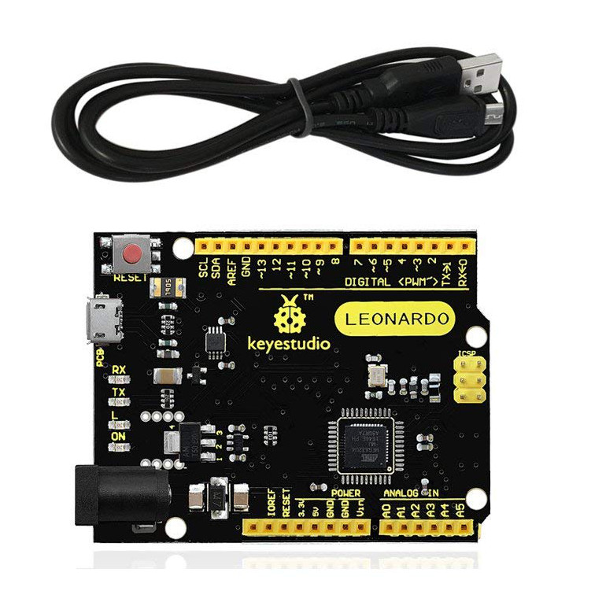

# NodeArt 2019

# MIDI

Musical Instrument Digital Interface

* note on
`[144,53,64]`

* note off
`[128,53,64]`

* control change
`[176,1,8]`

## Web MIDI

```javascript

navigator.requestMIDIAccess({ sysex: false })
  .then(function(access) {

     // Get lists of available MIDI controllers
     const inputs = access.inputs.values();
     //const outputs = access.outputs.values();

     inputs[0].onmidimessage = function (message) {
        const data = message.data; // this gives us our [command/channel, note, velocity] data.
        console.log('MIDI data in', data); // MIDI data [144, 63, 73]
     }
  });

```


## MIDI controller


* Leonardo - Micrcontroller
* buttons
* potentiometers
* wires




[MIDI firmware](midi_firmware)
